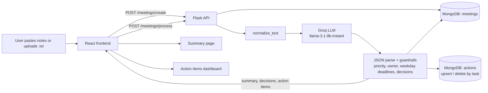

# AI Meeting Notes & Action Tracker

Paste or upload raw meeting notes and get back a summary, the key decisions, and a tracked list of action items with owners, priorities and deadlines.

**Live demo:** https://ai-meeting-notes-zeta.vercel.app

## Why

Meeting notes are usually a wall of text, and the follow-ups in them get lost.
This app turns those notes into structured data you can review, edit and track to completion.

## Key features

- **LLM extraction via Groq** - notes are sent to Groq's chat completions API (default model `llama-3.1-8b-instant`, configurable with `GROQ_MODEL`) with a strict system prompt that demands JSON only.
- **Structured output** - each meeting yields:
  - a 2-4 sentence `summary`
  - `key_decisions` as short phrases
  - `action_items`, each with `task`, `owner`, `deadline` and `priority`
- **Post-processing guardrails** - the model output is not trusted as-is:
  - unparseable responses fall back to an empty, well-formed result
  - priority is coerced to `High` / `Medium` / `Low` (default `Medium`)
  - missing owners become `Unassigned`
  - deadlines are kept only if they are a plain weekday that literally appears in the notes; anything containing digits or an inferred date is dropped
  - decisions are backfilled from owner + task pairs and de-duplicated
- **Action item tracking** - action items are stored in their own collection with a `Pending` status. Re-processing a meeting updates matching tasks, inserts new ones and removes ones that no longer appear.
- **Dashboard** - change status, edit owner / priority / deadline, and filter by owner or priority.
- **Meeting history** - browse past meetings and reopen any summary.
- **Auth** - email + password signup (hashed with Werkzeug), JWT access and refresh tokens via Flask-JWT-Extended. Every meeting and action query is scoped to the signed-in user.
- **Input validation and rate limiting** - Pydantic schemas on every write route, a password strength rule on signup, and a default Flask-Limiter limit of 100 requests per hour per IP.

## Pipeline



## How a request flows

1. The user signs in; the frontend stores the JWT and attaches it as a `Bearer` header on every API call.
2. On the upload page the user pastes notes or loads a `.txt` file and submits.
3. `POST /meetings/create` validates the payload and stores a meeting document with empty AI fields.
4. `POST /meetings/process` normalizes the text and sends it to Groq with the extraction prompt.
5. The response is parsed as JSON and cleaned: priorities, owners, weekday-only deadlines, de-duplicated decisions.
6. The summary and decisions are written to the meeting, and action items are synced into the `actions` collection.
7. The frontend routes to `/summary/:meetingId`; the items then appear on the action dashboard for status updates and edits.

## Tech stack

| Layer | Tools |
| --- | --- |
| Frontend | React 19, Vite 7, React Router 7, Tailwind CSS 4, Zustand, Axios, Framer Motion, lucide-react |
| Backend | Python, Flask 3, Flask-JWT-Extended, Flask-Limiter, Flask-CORS, Pydantic 2, Gunicorn |
| AI | Groq API (Llama 3.1 8B Instant by default) |
| Data | MongoDB via PyMongo (`users`, `meetings`, `actions`, indexed on `user_id` and `meeting_id`) |
| Hosting | Frontend on Vercel (`frontend/vercel.json` SPA rewrite) |

## Project structure

```
ai-meeting-notes/
├── backend/
│   ├── app.py              # Flask app, CORS, JWT, rate limiter, blueprints
│   ├── config.py           # env-driven settings
│   ├── database/mongo.py   # Mongo client, collections, indexes
│   ├── models/             # user creation + password hashing
│   ├── routes/             # auth, meetings, actions
│   └── services/           # ai_service (Groq + guardrails), meeting/action logic
└── frontend/
    └── src/
        ├── api/            # Axios client + endpoint wrappers
        ├── pages/          # Upload, Summary, Actions, History, Login, Signup
        ├── components/     # UI sections per page
        └── store/          # Zustand store
```

## API

| Method | Path | Auth | Purpose |
| --- | --- | --- | --- |
| POST | `/auth/signup` | - | Create an account |
| POST | `/auth/login` | - | Get access + refresh tokens |
| POST | `/auth/refresh` | refresh token | New access token |
| POST | `/meetings/create` | JWT | Store raw notes |
| POST | `/meetings/process` | JWT | Run AI extraction and sync action items |
| GET | `/meetings/` , `/meetings/<id>` | JWT | List (paginated) or fetch meetings |
| GET | `/actions/` | JWT | List action items (paginated) |
| PATCH | `/actions/<id>` | JWT | Update status, owner, priority or deadline |

## Run locally

**Backend** (needs a MongoDB instance and a Groq API key)

```bash
cd backend
python -m venv venv
source venv/bin/activate        # Windows: venv\Scripts\activate
pip install -r requirements.txt
# create backend/.env with the variables below
python app.py                   # serves on http://127.0.0.1:5000
```

Environment variables:

- `GROQ_API_KEY` (required)
- `MONGO_URL` (required)
- `JWT_SECRET_KEY` (required, at least 16 characters)
- `GROQ_MODEL` (optional, defaults to `llama-3.1-8b-instant`)
- `DEBUG` (optional, `True` to enable Flask debug mode)

**Frontend**

```bash
cd frontend
npm install
npm run dev                     # http://localhost:5173
```

Set `VITE_API_URL` in `frontend/.env` to point at the backend; it defaults to `http://127.0.0.1:5000`.

## Possible next steps

- Accept audio recordings and add a speech-to-text step in front of the existing extraction pipeline.
- Use the model's JSON mode and add a small evaluation set of sample meetings to measure extraction quality across prompt or model changes.
- Use the `/auth/refresh` endpoint from the frontend for silent session renewal, and add calendar export for action-item deadlines.
